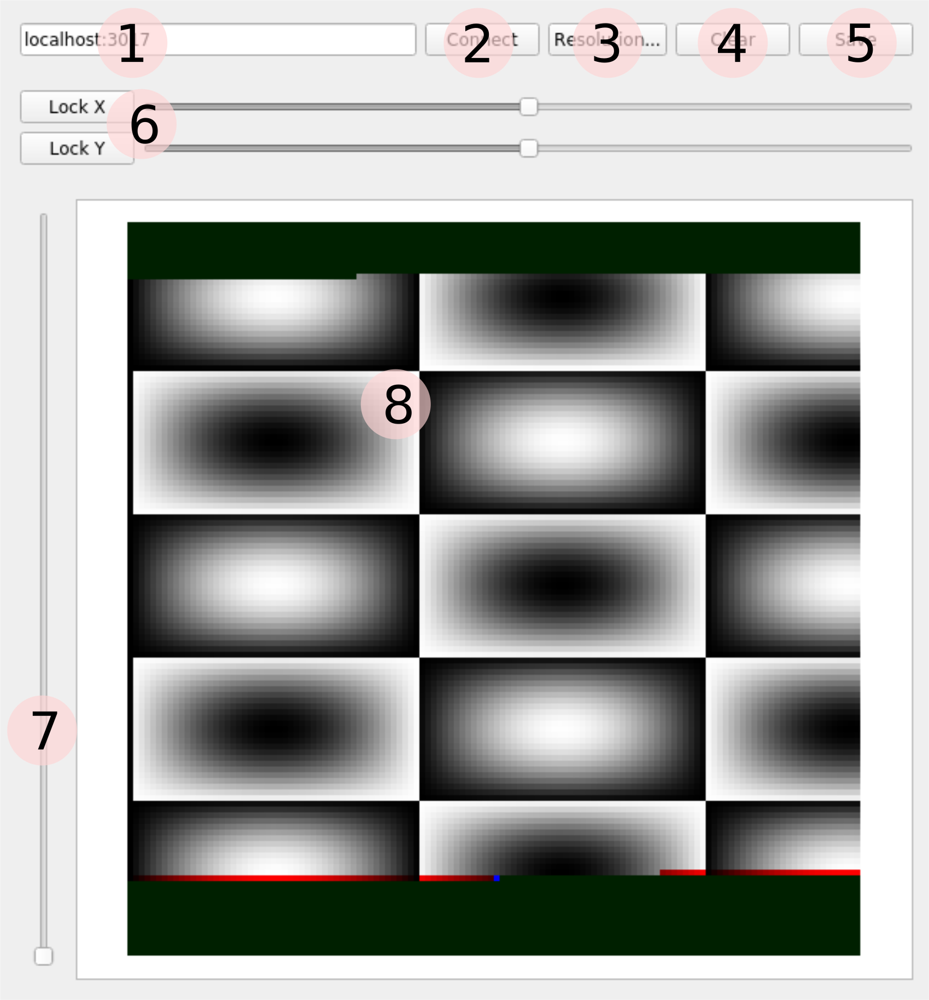

# Pion Microscope

This is the source code for a project which attempts to use a Raspberry Pi to control an ion beam and simultaneously obtain measurements which can be used to image a sample being impacted by the ion beam.

This requires:

1. Rasperry Pi
2. Waveshare AD/DA Board
3. Vacuum chamber and ion source
4. Amplifiers to drive electrostatic optics

## Components

The project is divided into two components; the `piController` is responsible for running the beam control software on a Raspberry Pi. It runs a TCP server, which a client can communicate with to control the beam and retrieve
imaging information. The `localViewer` is a client for this server, presenting a real-time display of the imaging data and providing some basic GUI controls for manual control of the beam, saving image data, etc.

## Building

Building the `localViewer` application requires [Qt5](https://www.qt.io/); with qmake in your path, building is simply:

    $ cd localViewer
	$ qmake
	$ # Or, to build in debug:
	$ qmake CONFIG+=Debug
	$ make

This will create an executable `localViewer` in the current directory. This can simply be run directly to start the viewer. It may be possible to build the localViewer such that it runs on the Raspberry Pi; for performance
reasons, though, it is preferable to run it on a different computer, so does not interfere with control of the ion beam.

Building the `piController` has slightly more options; there are several ways you may wish to do this:

1. Build on Raspberry Pi
2. Build locally, targeting Raspberry Pi
3. Build locally, simulating Raspberry Pi

In general, it's not desirable to choose option #1 -- compiling the code on-target is slow and can be frustrating. However, if you have the code on the Raspberry Pi, as well as installing cmake and a C++ compiler:

    $ mkdir piController/build_1
	$ cd piController/build_1
	$ cmake ..
	$ make

For option #2, you will need to clone the [Raspberry Pi cross compiling toolchain](https://github.com/raspberrypi/tools) and modify the file piController/RaspberryPi-Toolchain.Cmake, changing the definition of PICHAIN so that
it points to the location of the arm-rpi-4.9.3-linux-gnueabihf in your cloned toolchain.

	$ mkdir piController/build_2
	$ cd piController/build_2
	$ cmake .. -DCMAKE_TOOLCHAIN_FILE=../RaspberryPi-Toolchain.Cmake
	$ make

This should build and construct exactly the same executables as if you had chosen option #1, albeit significantly faster.

If you do not need to run on the Raspberry Pi (i.e. you don't need to worry about the real state of the beam control), you can run the same commands for option #1, but on your local computer. This will emit executables for your
current architecture, but also will #define a SIMULATOR preprocessor option. This option stubs out the GPIO functions, replacing the D2A implementations with no-ops and the A2D readings with dummy values. This is useful if you
wish to work on the client-server communication without needing access to the Raspberry Pi.

## Running

On the Raspberry Pi, the beam controller is located within the build directory (e.g. piController/build\_1, if following option #1) as src/piController. This program is not interactive -- it simply starts a TCP server listening
on port 3017, writes deflection voltages to DAC0 and DAC1 channels on the WaveShare board and reads sample current on AD0.

For the Raspberry Pi, two additional applications are built, though these are not necessary for image formation from the ion beam. `dacTest` interactively prompts for a voltage to write to DAC0 and DAC1 -- however, it also
attempts to communicate with a second WaveShare board (DAC2, DAC3), and can be used to verify the chip-select lines are operating as expected, for the (unsupported) case of using two Waveshare boards simultaneously. `readA0Test`
is a non-interactive test program which simply writes a CSV to standard output with columns for time and the voltages seen on the first two A2D channels -- this can be used to check the state of other circuitry.

If building with option #2, there is a minor hurdle, which is that the built executables are not located on the Raspberry Pi. They could be copied across manually, but I found mounting a network drive was easiest:

    $ ssh addres.of.pi
	$ mkdir /tmp/remote
	$ sshfs address.of.dev.computer:/path/to/build_2 /tmp/remote
	$ cd /tmp/remote

Then, the `build_2` directory is transparently accessible on the Raspberry Pi, making iteration on the software very quick.

On starting the local viewer, a window is presented with contents:

The labelled components are:

1. The address:port of the server we wish to connect to. Likely "localhost:3017" if running the "simulated", otherwise, substitute "localhost" for the IP address of the Raspberry Pi
2. Connect button will attempt to connect to the server described in #1
3. Once connected, this allows to change the resolution of the deflection plate voltages. Lower resolutions will significantly speed up scanning and can help with focussing the beam
4. Erases any any image previously transmitted from the server
5. Allows the current image to be saved to a file
6. "Lock/Unlock" buttons toggle manual beam control -- when an axis is "locked", the piController will not modify the position of the beam on that axis. The sliders become active, and the beam will follow the values of the
   sliders. This can be useful to set the gain on the deflection amplifiers and make minor adjustments to beam focus
7. Displays a scale of the most recently received value from the piController; useful simply to gauge activity
8. Display of the received image. Before connection, will be blue. After connection or clearing, will be a dark green, to indicate no data for that area has been received yet. The beam head (most recent position) is displayed
   in blue, and several of the most recent positions are displayed with a red tint. The remainder of the image is greyscale, corresponding to the A2D reading at that point.

## Architecture

### piController

All the relevant code for running the beam control server is located in piController/src, although common packet definitions for client-server communication are located in protocol/Protocol.h.

Due to our desire to use Waveshare boards outside their intended specification, much of the provided libraries for communication with the ADS1256 and DAC8532 have been removed and re-implemented ourselves. The only remaining
Waveshare code is a header for each chip, with various definitions, such as pin identifiers, command sizes, etc. Our own implementation of the communication is documented in `DACBoard.h`, and implemented in `DACBoard.cpp`

The controller is divided into two logical sections, with implementations in `BeamController.hpp` and `ControlServer.hpp`;

The `BeamController` is responsible for modifying the beam. As often as possible, we call `BeamController::step()`, which updates the deflection plates based on a scanning pattern (if the axes are not locked to manual control),
which produces a single `BeamState` struct, describing the last state of the deflection plates, and the most recently seen reading from the sample.

The `ControlServer` manages the network connection; every time we step() it, it is given the current `BeamState`. Inside here, several things happen; first, it checks to see if any new clients have connected, adding any to a list. Next, each of the clients are polled, to see if they are sending any commands (such as manual beam control or change of resolution). Finally, any new updates to the beam control are sent to every client.

To facilitate commands which are read by the `ControlServer`, but wish to have an effect on the `BeamController`, an abstract interface is used; the `CommandHandler` is a set of virtual interfaces (implemented by
`BeamController`) to pass messages between the two classes, without any knowledge of each other.

The main loop of the piController simply attempts to call both `step()` functions with as high a frequency as possible.

### localViewer

The structure of the localViewer mimics that of the piController, though, within the context of an interactive application (as such, it may be helpful to understand how Qt applications are designed.) This is more heavily
focussed on message passing, as many of the codepaths are triggered by direct user action, such as clicking on a button.

Most importantly, is the `BeamClient` class; this is analogous to the `ControlServer`, where, after we `connect()` to a server, will automatically call `dataReadyToRead()` whenever data has been sent from the piController. This
function interprets the data and uses it to emit signals, most of which are wired into simple slots for (e.g. adjusting the position of sliders) and very little computation actually has to be done.

The other important classes in this application are the `ViewerWindow`, which is the main GUI container, and contains all the widgets, buttons, etc. Most of this is creation and modification of the UI. Finally, we have the
`ImageGenerator`, whose `updatePixels()` is called when new `BeamState` updates arrive. This class is responsible for keeping track of these updates and using them to compose an image. On every update, it generates a new image,
and sends to the `ViewerWindow` by emitting a signal.

